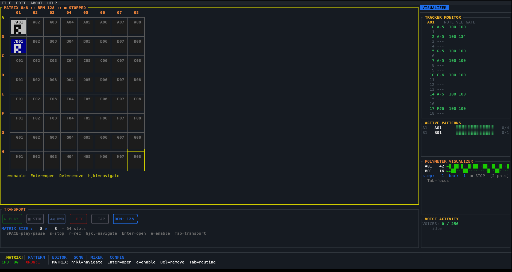
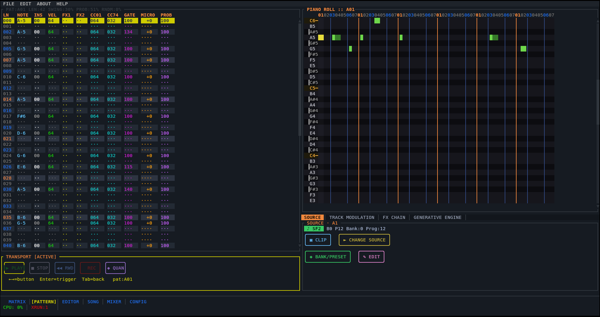

# SeqTerm

> A terminal-based music sequencer, sampler, and granular synthesizer.
> Runs entirely in a terminal.

```
╔══════════════════════════════════════════════════════════════════════╗
║  SEQTERM v0.1 :: live_set :: 128 BPM :: PipeWire :: CPU 3%          ║
╠══════════════════════════════════════════════════════════════════════╣
║ ▶ 1.MATRIX  2.PATTERN  3.EDITOR  4.SONG  5.MIXER  6.CONFIG    ║
╚══════════════════════════════════════════════════════════════════════╝

  A·KCK ▶▶▶▶▶▶▶▶▶▶▶▶▶▶▶▶  B·SNR ░░░░░░░░▶▶▶▶▶▶▶▶  C·HH ▶▶▶▶▶▶▶▶▶▶▶▶▶▶▶▶
  D·BSS ░░░░░░░░░░░░░░░░░  E·LEAD▶▶▶▶▶▶▶▶░░░░░░░░  F·PAD ░░░░░░░░░░░░░░░░
```

---

## Screenshots

### Matrix — 8×8 clip launcher



### Pattern — step sequencer / tracker



---

## Platform Support

| Platform          | Audio          | MIDI           | Release artifact |
|-------------------|----------------|----------------|------------------|
| Linux x86\_64     | PipeWire / JACK / ALSA | midir + virtual ports | `.deb` `.rpm` `.tar.gz` |
| Linux ARM64       | PipeWire / JACK / ALSA | midir + virtual ports | `.deb` |
| Linux ARMv7 (Pi)  | ALSA           | midir          | `.deb` (cross) |
| macOS (Universal) | CoreAudio      | CoreMIDI       | `.dmg` |
| Windows x86\_64   | WASAPI         | WinMM          | `.msi` |

**Terminal requirements:** TrueColor + UTF-8 — kitty, WezTerm, Alacritty, foot, iTerm2, Windows Terminal.

---

## Features

### Sequencer
- **8×8 Matrix Launcher** — fire/stop patterns per cell; polymeter (each row has independent length)
- **Step Sequencer / Tracker** — 16-field note editor (pitch, velocity, gate, micro-timing, CC01/CC11/CC74/CC93, pitch bend, MPE dimensions)
- **Arranger** — FL-Studio-style playlist with clip blocks, automation lanes, song-mode chain
- **Euclidean rhythms**, Markov chain generation, step mutation engine
- 480 PPQN clock at sub-millisecond precision; swing, probability, random gates

### Audio Engine (realtime-safe)
- **32-slot mixer** — no allocation, no mutex in the audio callback
- **SF2 SoundFont synthesis** — dual engine: **oxisynth** (pure Rust, default, 256 voices) or optional **FluidSynth** (512 voices + built-in reverb/chorus), selectable at runtime with automatic fallback. FluidSynth ships **embedded** (FluidLite, statically compiled — *no external libraries*); multiple simultaneous SF2 files
- **SF2 preset editor** — open a SoundFont preset in the EDITOR view (`E`) and reshape its zones (sample map, AHDSR envelope, filter, LFO, tuning) through SeqTerm's **own sampler**; edits are heard live and in the offline render, bypassing FluidSynth
- **Plugin hosting** — VST2 (functional) and **CLAP** (via `clack-host`: factory-accurate scan + live instrument audio with note/CC/pitch-bend and **polyphonic (MPE) note expression**, validated against Surge XT) host adapters
- **Drum channels** — MIDI ch 10 routing, 16-pad GM drum map, per-kit SF2 preset
- **Audio clip playback** — WAV/FLAC/MP3/OGG/AIFF via symphonia; trim, loop, pitch, reverse, normalize
- **Granular synthesis** — 32-voice engine; Linear / RandomWalk / Freeze scan modes; spray, density, pitch scatter
- **SP-404-style pad sampler** — 4×4 pads, 16 banks, mute/choke groups, skip-back capture
- **Bus sends A/B** with return volumes, mute
- **Per-slot FX chain** (pre-fader) + **master bus FX** (post-bus)
- **Spectrum Analyzer** — 32-band FFT overlay on MASTER strip; LUFS (momentary/short-term/integrated, K-weighted) + correlation meter on MASTER R; clip indicators + headroom display per slot

### FX Processors (25 total)
| Category | Processors |
|----------|-----------|
| Dynamics | Compressor (+ Limiter preset), Gate, Expander, Sidechain Duck |
| EQ / Filter | Parametric EQ (4-band biquad), 48-band Graphic EQ, 3-band Isolator, SVF |
| Modulation | Chorus, Flanger, Phaser |
| Time-based | Stereo Delay (ping-pong), Freeverb Reverb, Granular Delay, Looper |
| Colour | Bitcrusher, Soft Clipper, Tube Saturation, Cassette Tape, Vinyl Sim |
| Utility | Gain, Pan, Stereo Widener (M/S), Phase Invert, Mono Maker |

### MIDI
- Multi-port MIDI I/O via midir; virtual ports (one per pattern)
- MIDI clock output (24 PPQ); Start/Stop sync
- SMF Type 0/1 import → patterns (quantized, CC/PB preserved, tempo map → automation lane)
- MusicXML export
- **Universal MIDI Learn** — bind any CC to mixer channels (volume/pan/sends), BPM, master/slot FX params, or EDITOR parameters. The same knob can be reused across windows: a binding scoped to the current view takes priority, with global bindings as fallback. `Ctrl+L` learns the focused parameter
- OSC server (UDP, rosc) for TouchOSC / SuperCollider control
- MIDI 2.0 UMP utilities + MIDI 1↔2 conversion
- MPE channel allocation per clip

### Persistence
- JSON + MessagePack with atomic write-rename; autosave every 60 s
- Schema migrations (v0→v1)
- `.stz` ZIP container format — UUID-based asset/object registry, forward migrations, scene snapshots (`Ctrl+T`)
- **System-wide undo/redo** — every project edit (notes, clips, patterns, FX add/remove, quantize/humanize, chain, sampler pads, SF2 edits, …) is captured as a reversible snapshot command (`Ctrl+Z` / `Ctrl+Y`)
- **Offline Rendering** — full project mixdown and per-row stem export to WAV without real-time constraint (`Ctrl+E`)

---

## Install

### From release (recommended)

Download the latest release for your platform from the [Releases page](../../releases).

**Debian / Ubuntu / Raspberry Pi OS:**
```bash
sudo dpkg -i seqterm_0.1.0_amd64.deb   # or arm64.deb / armhf.deb
seqterm
```

**Arch Linux (AUR):**
```bash
yay -S seqterm
```

**macOS:**
```bash
# Open the .dmg, drag SeqTerm to Applications
open /Applications/SeqTerm.app
```

**Windows:**
```
Run the .msi installer, then launch from Start Menu or:
seqterm.exe
```

### From source

```bash
# Linux: install system dependencies
sudo apt install build-essential libasound2-dev pkg-config   # Debian/Ubuntu
sudo pacman -S base-devel alsa-lib                           # Arch

# macOS: Xcode command-line tools suffice
xcode-select --install

# Install Rust (all platforms)
curl --proto '=https' --tlsv1.2 -sSf https://sh.rustup.rs | sh

# Clone and build
git clone https://github.com/your-org/seqterm
cd seqterm
cargo build --release
cargo run --release -p seqterm-app
```

#### Optional: build with the FluidSynth SF2 engine

The default build is pure-Rust (oxisynth). The higher-fidelity FluidSynth engine
ships **embedded** — its synthesis core (FluidLite) is statically compiled into the
binary, so there is **nothing to install** and the same command works on every OS:

```bash
# Linux · macOS · Windows · Raspberry Pi — identical, no external libraries
cargo build --release -p seqterm-app --features fluidsynth
```

The only build-time requirement is a C compiler, which the toolchain already needs
(`cc`/`clang`/MSVC). The resulting binary has **no** dynamic dependency on
`libfluidsynth` or GLib.

<details>
<summary>Advanced: link the full <b>system</b> libfluidsynth 2.x instead</summary>

If you specifically want full FluidSynth 2.x (dynamically linked), use the
`fluidsynth-system` feature and install the library:

```bash
sudo apt install libfluidsynth-dev      # Debian/Ubuntu/Raspberry Pi OS
sudo dnf install fluidsynth-devel       # Fedora
brew install fluid-synth                # macOS (Homebrew)
vcpkg install fluidsynth && set FLUIDSYNTH_LIB_DIR=...\lib   # Windows (vcpkg)

cargo build --release -p seqterm-app --features fluidsynth-system
```
</details>

See [`docs/architecture/sf2-engine.md`](docs/architecture/sf2-engine.md) for how
engine selection works.

---

## Audio Backends

SeqTerm uses [CPAL](https://github.com/RustAudio/cpal) for cross-platform audio. The backend is selected automatically:

| OS | Auto-selected | Manual override |
|----|---------------|-----------------|
| Linux | PipeWire → JACK → ALSA | `SEQTERM_AUDIO_BACKEND=jack` |
| macOS | CoreAudio | — |
| Windows | WASAPI | — |

**PipeWire** (Linux): SeqTerm connects natively. No configuration needed.

**JACK** (Linux/macOS): Start your JACK server before launching SeqTerm, or use:
```bash
pw-jack seqterm    # PipeWire JACK bridge
```

**ALSA** (Linux headless / Raspberry Pi):
```bash
SEQTERM_AUDIO_BACKEND=alsa seqterm
```

**Audio settings** (buffer size, sample rate, backend) are configurable in **View 5 → Config → Audio**.

---

## SF2 SoundFont Support

SeqTerm ships two interchangeable SF2 sample engines behind a single interface:

| Engine | Implementation | Default | Voices | Notes |
|--------|----------------|:-------:|:------:|-------|
| **oxisynth** | pure Rust ([OxiSynth](https://github.com/PolyMeilex/OxiSynth)) | ✅ | 256 | No native deps; runs everywhere incl. Raspberry Pi |
| **FluidSynth** (embedded) | FluidLite, statically compiled into the binary | opt-in (`--features fluidsynth`) | 512 | **No external libraries**; built-in reverb/chorus; SF2 + SF3 |
| **FluidSynth** (system) | `libfluidsynth` ≥ 2.0, dynamically linked | opt-in (`--features fluidsynth-system`) | 512 | Full FluidSynth 2.x; needs libfluidsynth installed |

```bash
# Assign an SF2 file to a clip (View 1 — Matrix)
f           # open SF2 browser for selected cell
            # browse bank/preset → Accept

# Drum channels (View 4 — Mixer)
D           # toggle drum channel (routes to MIDI ch 10, auto-selects bank 128)
```

### Choosing the engine

Pick the engine in **View 5 → Config → Audio → SF2 engine** (`oxisynth` / `fluidsynth`),
or from the environment:

```bash
SEQTERM_SF2_BACKEND=fluidsynth seqterm
```

The choice applies to **newly loaded** SoundFonts. If FluidSynth is requested but the
binary was built without a FluidSynth engine feature, SeqTerm logs a warning and
**falls back to oxisynth automatically** — playback never goes silent. The Audio
settings row shows `fluidsynth (not built → oxisynth)` in that case.

Recommended free SoundFonts:
- **GeneralUser GS** — full GM set, 1.4 MB compressed
- **FluidR3_GM** — high-quality GM, 141 MB
- **Arachno SoundFont** — detailed GM + extensions, 148 MB

Multiple SF2 files load in parallel — each clip references its own file without memory duplication within the same file.

---

## Raspberry Pi

SeqTerm runs on **Pi 4 / Pi 5** with ALSA at low latency. See [`docs/raspberry-pi.md`](docs/raspberry-pi.md) for:
- ALSA buffer tuning (`/etc/asound.conf`)
- `rtirq` / `chrt` scheduling for the audio thread
- Recommended SF2 files for Pi memory budget
- Headless performance tips

Quick start on Pi OS 64-bit:
```bash
sudo apt install libasound2-dev
cargo build --release --target aarch64-unknown-linux-gnu
# Or download the arm64.deb from Releases
```

---

## Environment Variables

| Variable | Default | Description |
|----------|---------|-------------|
| `SEQTERM_PROJECT` | `projects/default.json` | Project file to load on startup |
| `SEQTERM_AUDIO_BACKEND` | auto | `pipewire` / `jack` / `alsa` / `wasapi` / `coreaudio` |
| `SEQTERM_SAMPLE_RATE` | 48000 | Audio sample rate |
| `SEQTERM_BUFFER_SIZE` | 512 | CPAL buffer frames |
| `SEQTERM_SF2_BACKEND` | `oxisynth` | SF2 engine: `oxisynth` or `fluidsynth` (used when no explicit setting) |
| `PIPEWIRE_QUANTUM` | system | PipeWire quantum (e.g., `256/48000`) |
| `RUST_LOG` | `warn` | Log level (`debug` for verbose) |

**Build-time — only for the `fluidsynth-system` feature** (the default embedded
`fluidsynth` engine needs none of these):

| Variable | Used by | Description |
|----------|---------|-------------|
| `FLUIDSYNTH_LIB_DIR` | `build.rs` | Directory containing `libfluidsynth` — required on Windows/vcpkg, optional elsewhere for non-standard prefixes |
| `FLUIDSYNTH_LIB_NAME` | `build.rs` | Override the library base name (default `fluidsynth`) |

---

## Key Bindings

### Global

| Key | Action |
|-----|--------|
| `1–6` | Switch view |
| `Space` | Play / Stop |
| `s` | Stop |
| `r` | Record toggle |
| `+` / `-` | BPM ±1 |
| `?` | Help |
| `Ctrl+S` | Save |
| `Ctrl+Z` / `Ctrl+Y` | Undo / Redo (system-wide) |
| `Ctrl+L` | MIDI Learn the focused parameter |
| `Esc` | Close modal / cancel |

### Matrix (1)

| Key | Action |
|-----|--------|
| `↑↓←→` / `hjkl` | Move cursor |
| `Enter` | Launch / stop clip |
| `e` | Edit in Tracker |
| `E` | Edit SF2 preset in the EDITOR view (own sampler) |
| `f` | Assign SF2 source |
| `F` | Assign audio file |
| `Del` | Remove clip source |
| `m` | Mute/unmute row |
| `Tab` | Cycle sidebar panels |

### Tracker / Piano Roll (2)

| Key | Action |
|-----|--------|
| `↑↓` | Step cursor |
| `Enter` | Edit step |
| `i` | Insert (vim) |
| `v` | Visual select |
| `y` / `p` | Yank / paste steps |
| `[` / `]` | Pattern length ±1 |
| `Tab` | Cycle sections |

### Editor / Granular (3)

| Key | Action |
|-----|--------|
| `f` / `F` | Freeze / unfreeze grain buffer |
| `V` | Cycle live input source (audio slot → off) |
| `L` | Capture live texture to the current pad |
| `r` | Happy accidents (randomise preset) |
| `W` | Write current scene to slot |
| `1–8` | Recall scene slot (`Shift+1–8` morphs over 4 beats) |
| `X` | Delete focused scene slot |
| `[` / `]` | Move scene-slot focus |
| `Tab` | Cycle modulation-matrix sub-field |
| `Enter` | Toggle modulation row |
| `←→` on a Macro | Adjust macro value |
| `F` on a Macro | Cycle that macro's FX target |
| `Ctrl+L` | MIDI Learn the focused parameter |
| `g` | Back to Matrix |

> **Macros 1-16** live in the MOD/GRANULAR tabs (two columns of 8). Macros 1-4
> morph the granular sound (spray/density/pitch/size); **any** macro can be
> assigned an FX parameter target with `F`, which the realtime modulation driver
> morphs by the macro value. The bank is the project's `fx_modulation` system, so
> it persists and is shared with LFO/automation modulation.

> When opened on an SF2 clip (via `E` in the Matrix), the same EDITOR screen edits
> the SoundFont preset through SeqTerm's **own sampler** (bypassing FluidSynth so
> edits are audible). `Space` previews the selected zone; `Esc` closes and persists
> the edit. See [`docs/architecture/sf2-engine.md`](docs/architecture/sf2-engine.md).

### Song / Arranger (4)

| Key | Action |
|-----|--------|
| `↑↓` | Select track |
| `←→` | Scroll bars |
| `[` / `]` | Move clip cursor |
| `d` | Duplicate clip |
| `Del` | Delete clip |
| `x` | Split clip at playhead |
| `g` | Glue clip with next |
| `H` | Toggle track hidden |
| `t` | Cycle track type |
| `c` | Cycle track color |
| `S` | Cycle snap grid |
| `Space` | Toggle clip multi-select |
| `Tab` | Cycle sections |

### Mixer (5)

| Key | Action |
|-----|--------|
| `↑↓` | Select channel |
| `Enter` | Edit parameter |
| `m` | Toggle mute |
| `o` | Toggle solo |
| `P` | Phase invert |
| `M` | Toggle mono |
| `R` | Toggle record arm |
| `D` | Toggle drum channel |
| `t` | Cycle channel type |
| `K` | Cycle channel color |
| `W` / `w` | Width +/- |
| `c` | Reset clip indicators |
| `Tab` | Toggle FX sidebar |

---

## Architecture

```
seqterm/                    31 crates, hexagonal architecture
├── seqterm-app/            Binary — wires all crates
├── seqterm-core/           Domain: Note, Pattern, Clip, Channel, Project, TrackKind
├── seqterm-ports/          Hexagonal port traits (AudioBackend, MidiBackend, InstrumentBackend…)
├── seqterm-engine/         Scheduler: 480 PPQN, polymeter, MPE, automation, song chain
├── seqterm-audio-engine/   Realtime audio: CPAL, Mixer(32), SF2, AudioClip, Granular, 25 FX,
│                           Spectrum Analyzer (32-band FFT), LUFS, OfflineRenderer
├── seqterm-midi/           MIDI I/O: midir, ALSA multi-port, MIDI 2.0 UMP + CI
├── seqterm-midi-io/        SMF import/export, MusicXML export, OSC server
├── seqterm-generative/     Euclidean, Markov, mutation engine
├── seqterm-application/    Use cases, EventBus, CommandBus
├── seqterm-persistence/    JSON/MessagePack, autosave, migrations
├── seqterm-stz/            .stz ZIP container: UUID objects, asset registry, scene snapshots
├── seqterm-history/        Undo/redo command stack (incl. universal ProjectSnapshot)
├── seqterm-audio-export/   WAV export utilities
├── seqterm-ui/             TUI (ratatui): 6 views, 20+ modals, full mouse support
├── seqterm-command/        AppCommand enum (100+ variants), AppEvent, HelpTopic
├── seqterm-settings/       AudioEngineConfig, AppSettings persistence
├── seqterm-plugin-vst2/    VST2 host adapter (functional, registered by default)
├── seqterm-plugin-vst3/    VST3 host adapter (scan + registry wiring; SDK pending)
├── seqterm-plugin-clap/    CLAP host adapter (clack-host: factory scan + live instrument audio)
├── seqterm-routing/        Routing graph with DFS cycle detection
├── seqterm-sdk/            Public SDK: prelude, core, ports re-exports, project helpers
└── …                       Scaffolds (not yet app-wired): plugin-au, plugin-sandbox,
                            fluidsynth, sfz, lua, ffi, collab, cloud, wasm, stz-cli
```

### Realtime Contract

The audio callback (`Mixer::mix()`) is:
- **Allocation-free** — all buffers are pre-allocated
- **Lock-free** — `rtrb` ring buffer for commands; `atomic` for peak/RMS stats
- **Mutex-free** — no `Mutex::lock()` on the hot path

---

## Tests

```bash
cargo test --workspace       # 258 tests across all crates
```

Key test suites:
- `seqterm-audio-engine` (90): Compressor, Gate, ParametricEq, Chorus, Flanger, Expander, Pan, RMS convergence, LUFS, Spectrum, Mixer
- `seqterm-core` (35): Channel serialization roundtrip (all fields), drum channel, FxKind cycle
- `seqterm-engine` (11): Scheduler, polymeter, transport
- `seqterm-persistence` (14): Atomic save, migrations, autosave
- `seqterm-stz` (17): UUID registry, asset, snapshot, migration

---

## Credits

- **Jorge Codelia** — author & maintainer
- **Claude Code** — development assistance

---

## License

MIT — 2026
