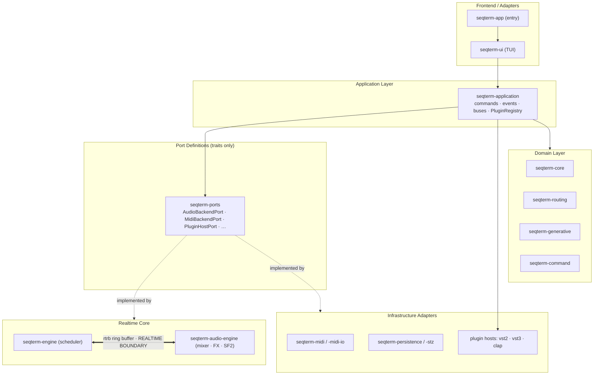

# SeqTerm — Architecture

> Real-time modular music sequencer, sampler, and granular synthesizer for Linux terminals.

---

## Overview

SeqTerm is a **hexagonal (ports & adapters) architecture** written in Rust 2024.
The domain core has zero runtime dependencies; all I/O is injected via trait objects.



> **Realtime boundary:** no `Mutex`, allocation, or blocking call crosses the
> `rtrb` ring buffer connecting `seqterm-engine` ↔ `seqterm-audio-engine`.

```
┌─────────────────────────────────────────────────────────┐
│                     APPLICATION LAYER                   │
│  AppCommand → dispatch_command() → domain + adapters    │
├──────────────┬──────────────────┬───────────────────────┤
│  DOMAIN CORE │   USE CASES      │    EVENT BUS          │
│  seqterm-core│ seqterm-applic.  │  DomainEvent (flume)  │
├──────────────┴──────────────────┴───────────────────────┤
│                      PORTS (traits)                     │
│  AudioBackendPort  MidiBackendPort  ProjectRepository   │
│  AudioSource       PluginHostPort   ExporterPort        │
├──────────────────────────────────────────────────────────┤
│                     ADAPTERS (impls)                    │
│  CpalAudioBackend  MidirMidiAdapter  JsonProjectRepo    │
│  Vst2PluginHost    MidiIo / OSC      AudioExporter      │
└──────────────────────────────────────────────────────────┘
```

---

## Crate Graph

```
seqterm-app
  └── seqterm-ui  ──────────────────────────────────────┐
        ├── seqterm-application                          │
        │     └── seqterm-plugin-vst2                   │
        ├── seqterm-audio-engine ── seqterm-ports        │
        ├── seqterm-audio-export                         │
        ├── seqterm-engine ──────── seqterm-core         │
        │     └── seqterm-generative                     │
        ├── seqterm-midi ─────────── seqterm-ports       │
        ├── seqterm-midi-io                              │
        ├── seqterm-persistence ──── seqterm-core        │
        ├── seqterm-history ──────── seqterm-core        │
        ├── seqterm-settings                             │
        ├── seqterm-command ──────── seqterm-midi-io     │
        └── seqterm-routing                              │
              └── seqterm-core ◄────────────────────────┘
```

Dependency rule: **lower crates never import higher crates**.  
`seqterm-core` depends only on `serde`, `thiserror`, and `seqterm-routing`.

---

## Real-Time Audio Contract

The audio callback (`CpalAudioBackend::process`) is **strictly real-time safe**:

```
Allowed in RT callback          NOT allowed
─────────────────────────────   ──────────────────────────
rtrb ring buffer reads          Arc::clone / Rc
pre-allocated Vec operations    Mutex / RwLock
atomic loads/stores             Box::new / Vec::push
SIMD intrinsics (AVX2+FMA)      File I/O / networking
stack allocation                std::thread::spawn
```

The non-RT world sends commands via `rtrb::Producer<AudioCommand>`.  
Large payloads (loaded `Box<dyn AudioSource>`) travel the same ring buffer after
being built on a background asset thread.

---

## Audio Engine

```
AudioEngine (non-RT handle)
  │  rtrb ring buffer  AudioCommand
  ▼
AudioCallback (RT, owns Mixer)
  │
  ├── Slot 0..31  Box<dyn AudioSource>
  │     ├── SoundFontSynth   — SF2 via oxisynth
  │     ├── AudioClipPlayer  — WAV/FLAC/MP3/OGG via symphonia
  │     └── GranularEngine   — grain cloud processor
  │
  ├── Mixer::mix()
  │     ├── per-slot volume + send_a/send_b
  │     ├── mix_accumulate() — AVX2+FMA SIMD / scalar fallback
  │     ├── Bus A return + Bus B return
  │     └── soft-clip master
  │
  └── SkipBackBuffer::push_block()   — lock-free circular, last N seconds
```

### FX Chain

All FX implement `FxProcessor::process_block(&mut [f32], sample_rate)` + `name() -> &str`.
Allocations happen only at construction; the audio path is zero-alloc.

| Category   | Processor         | Algorithm / Notes                                           |
|------------|-------------------|-------------------------------------------------------------|
| Dynamics   | Compressor        | Feed-forward peak, soft-knee, makeup; `.limiter()` preset   |
|            | Gate              | Threshold, hold phase, range floor                          |
|            | Expander          | Downward/upward, threshold/ratio/attack/release/range       |
|            | SidechainDuck     | LFO or trigger-based ducking                                |
| EQ/Filter  | ParametricEq      | 4-band biquad: HP · LowShelf · Peak · HighShelf/LP          |
|            | FilterBankFx      | 48-band graphic EQ                                          |
|            | Isolator          | 3-band SVF (bass/mid/treble), 48 dB/oct                     |
|            | Svf               | Topology-preserving state-variable filter (Simper 2013)     |
| Modulation | Chorus            | LFO-modulated delay lines, stereo π-offset                  |
|            | Flanger           | Short delay + feedback, optional stereo                     |
|            | Phaser            | 2–8 all-pass stages, LFO sweep                              |
| Time-based | DelayLine         | Stereo ping-pong, feedback, 1-pole LP damping               |
|            | Reverb            | Freeverb: 8 comb + 4 allpass (stereo)                       |
|            | GranularDelay     | Granular feedback delay                                     |
|            | Looper            | RT loop recorder: Idle/Record/Play/Overdub                  |
| Colour     | Bitcrusher        | Bit-depth quantisation + sample-hold decimation             |
|            | SoftClipper       | `tanh` waveshaper with drive                                |
|            | TubeSaturation    | Asymmetric triode waveshaper + HP tone                      |
|            | Cassette          | Tape saturation                                             |
|            | VinylSim          | LFO wow/flutter + LCG crackle noise                        |
| Utility    | Gain              | Utility gain stage (dB)                                     |
|            | Pan               | Linear + constant-power law panning                         |
|            | StereoWidener     | M/S processing (0=mono, 1=unity, 2=wide)                    |
|            | PhaseInvert       | Per-channel polarity flip                                   |
|            | MonoMaker         | Sum L+R to mono                                             |

### Spectrum Analyzer

`SpectrumAnalyzer` (in `spectrum.rs`) runs inside `Mixer::mix()`:
- 2048-point FFT via `rustfft`, Hann window
- 32 log-spaced bands, magnitude in dB, EMA-smoothed per band
- Published as 32 × `AtomicU32` (f32 bits) in `CpalAudioBackend`
- Polled by UI each frame → `App.master_spectrum: Vec<f32>` → `draw_spectrum_overlay` on MASTER L strip

---

## Granular Engine

```
GranularEngine
  ├── source: Vec<f32>       loaded mono buffer
  ├── freeze_buf: Vec<f32>   snapshot for freeze mode
  ├── grains: [Grain; 32]    fixed voice pool (no alloc)
  └── envs: EnvelopeTables   precomputed Hann/Gauss/Tri/Exp
```

Grain lifecycle per render block:

```
1. next_spawn countdown expires
2. try_spawn_grain():
     position = zone.position ± spray_rand * buf_len
     pitch_ratio = 2^(pitch_st/12)
     grain.spawn(start, duration, pitch_ratio, ...)
3. For each active grain:
     env = envs.sample(grain.envelope, grain.env_phase())
     (l, r) = grain.render_sample(src, env)   ← linear interpolation
     out[i] += l * gain,  out[i+1] += r * gain
4. Grains deactivate when elapsed >= duration
```

---

## Scheduler (seqterm-engine)

```
Scheduler thread (dedicated OS thread, not RT)
  │  PPQN = 24 pulses per quarter note
  │  step_duration_ns = 60e9 / (bpm * PPQN)
  │
  ├── For each tick:
  │     ├── transport triple-buffer write (UI reads lock-free)
  │     ├── for each active clip:
  │     │     note = pattern.steps[step % pattern.length]
  │     │     if source == MIDI → MidiRouter.send()
  │     │     if source == Sf2/AudioFile → AudioCommand::NoteOn/PlayClip
  │     │     MPE: MpeChannelMap.allocate() per note
  │     └── PendingNoteOff queue → send gate-off after gate duration
  │
  └── Automation: per bar, interpolate AutomationLane → apply target
```

---

## MPE (MIDI Polyphonic Expression)

```
MpeZone { kind: Lower|Upper, num_channels, pitch_bend_range }
MpeChannelMap { zone, slots: Vec<Option<note>>, next_slot }

allocate(note) → channel (round-robin, steals oldest when full)
release(note)  → frees the channel

Per-note expressions (sent before NoteOn on member channel):
  PitchBend (0xE0|ch)  — per-note pitch
  Pressure  (0xD0|ch)  — polyphonic aftertouch
  Timbre    (0xB0|ch, CC74) — modulation / timbre
```

---

## MIDI 2.0 (seqterm-midi/midi2.rs)

Universal MIDI Packet structure (32-bit words):

```
Word 0: [31:28]=MessageType [27:24]=Group [23:16]=Status [15:8]=Data0 [7:0]=Data1
Word 1: (Type 4 only) [31:16]=Velocity16 [15:0]=AttrData
```

Scaling (exact, no rounding error):

```
velocity:  7-bit → 16-bit  via bit replication: (v<<9)|(v<<2)|(v>>5)
cc value:  7-bit → 32-bit  via bit replication: (v<<25)|(v<<18)|(v<<11)|(v<<4)|(v>>3)
pitchbend: 14-bit → 32-bit via linear scale:    u14 * 0xFFFFFFFF / 16383
```

MIDI CI messages are SysEx7 payloads with a 13-byte header
(0x7E, device, 0x0D, sub-id2, version, src-MUID×4, dst-MUID×4).

---

## Plugin System

```
PluginHostPort (trait, seqterm-ports)
  └── Vst2PluginHost (seqterm-plugin-vst2)
        ├── scan(dir) → Vec<PluginDescriptor>
        ├── instantiate(id, sr, bs) → host_id
        ├── process(host_id, &[f32], &mut [f32])
        └── get_param / set_param / param_name / param_display / param_label

PluginRegistry (seqterm-application)
  ├── adapters: Vec<Box<dyn PluginHostPort>>
  └── instances: Vec<PluginInstance { registry_id, host_id, adapter_idx, mixer_slot, state }>
```

The UI presents a floating `Modal::PluginParams` with live ←→ nudging
(±1% per keypress) and `r` to refresh from plugin state.

---

## Persistence

```
Project (seqterm-core)
  │  serde + schema_version field
  ▼
JsonProjectRepository / BinaryProjectRepository
  ├── save: write to .tmp → atomic rename (no partial writes)
  ├── load: auto-detect JSON vs MessagePack, run migrations
  └── Autosave: background thread, every 60 s → <path>.autosave.json

History serialisation:
  seqterm-history → serial.rs → <path>.history.json (optional)
```

Schema migrations are forward-only; each version adds a migration closure
that transforms `serde_json::Value` before deserialisation.

---

## Sampler (SP-404 style)

```
SamplerConfig (stored in Project)
  └── banks: Vec<PadBank>   (up to 16 banks, A–P)
        └── slots: [Option<PadSlot>; 16]
              PadSlot { path, TriggerMode, MuteGroup, ChokeGroup,
                        pitch_st, gain, pan, reverse,
                        trim_start, trim_end, loop_start, loop_end, vel_to_vol }

TriggerMode: OneShot | Loop | Gate | Retrigger
MuteGroup(u8): 0=none, 1-8=exclusive group
ChokeGroup(u8): 0=none, 1-8=instant choke group
```

Skip-back buffer: lock-free circular `Vec<f32>` written by RT callback every block.  
Capture converts the last N seconds to a new `PadSlot` (non-RT, on demand).

---

## TUI Architecture

```
run_app() loop
  ├── app.tick()          drain engine events, MIDI inputs, OSC, autosave
  ├── terminal.draw(|f| ui(f, &mut app))
  │     ├── draw_transport_bar
  │     ├── match app.view:
  │     │     Matrix   → 8×8 clip grid, live oscilloscope, routing/hybrid sidebar
  │     │     Tracker  → step editor, piano-roll sidebar, modulation lane, FX chain
  │     │     Arranger → FL-style playlist, automation lanes, loop/marker rows
  │     │     Mixer    → channel strips (peak/RMS/CLIP/HR), MASTER L (spectrum),
  │     │                MASTER R (LUFS M/S/I, φ correlation), FX detail panel
  │     │     Config   → audio/MIDI/routing/keybindings/SF2/MIDI-learn sections
  │     │     Granular → grain cloud controls, scan envelope, preset management
  │     └── draw_modal (if app.active_modal.is_some())
  └── handle_key(app, event) → dispatch_command(app, AppCommand::*)

Modals (15 types):
  Alert / Confirm / Progress / Input / FilePicker / About / Help /
  AudioSettings / MidiSettings / CommandPalette / MidiImportOptions /
  KeybindingsEditor / AudioExportOptions / Sf2Browser / PluginParams
```

---

## Undo / Redo

Edits are recorded as `EditCommand`s in `seqterm-history`; `History` applies and
reverts them over the `Project` (`Ctrl+Z` / `Ctrl+Y`). Alongside typed commands
(`SetNote`, `SetClipSource`, `SetChannelParam`, …) there is a universal
`ProjectSnapshot { desc, before, after }` that stores a full `Project` clone
before/after an edit. `App::record_edit(desc, work)` wraps any mutating closure
with it, giving system-wide coverage (quantize/humanize, FX add/remove, chain,
sampler pads, SF2 edits, …) without a hand-written inverse per edit. After
undo/redo, `resync_after_history` rebuilds engine-side state from the project.

---

## CI / CD

```
.github/workflows/ci.yml
  fmt + clippy + build + test — Linux / macOS / Windows (matrix)

.github/workflows/release.yml  (triggered on tags v*.*.*)
  Linux x86_64:  binary + .deb + .rpm
  Linux ARM64:   binary + .deb (via cross)
  macOS:         Universal binary (lipo x86_64 + arm64) + .dmg
  Windows:       seqterm.exe + .msi (cargo-wix)
```

---

## Performance Notes

- **Mixer SIMD**: AVX2+FMA `_mm256_fmadd_ps` processes 8 f32 lanes/cycle
  with runtime detection (`is_x86_feature_detected!`), scalar fallback on ARM/non-AVX
- **Grain pool**: fixed 32-slot array — no heap allocation during audio render
- **Skip-back**: `AtomicUsize` head/filled, `Vec<f32>` written without locking
- **Transport state**: `triple_buffer` SPSC — scheduler writes, UI reads, never blocks
- **ALSA client**: single multi-port SeqTerm client avoids the 64-client ALSA limit
- **Autosave**: background thread, never blocks the UI or RT threads
