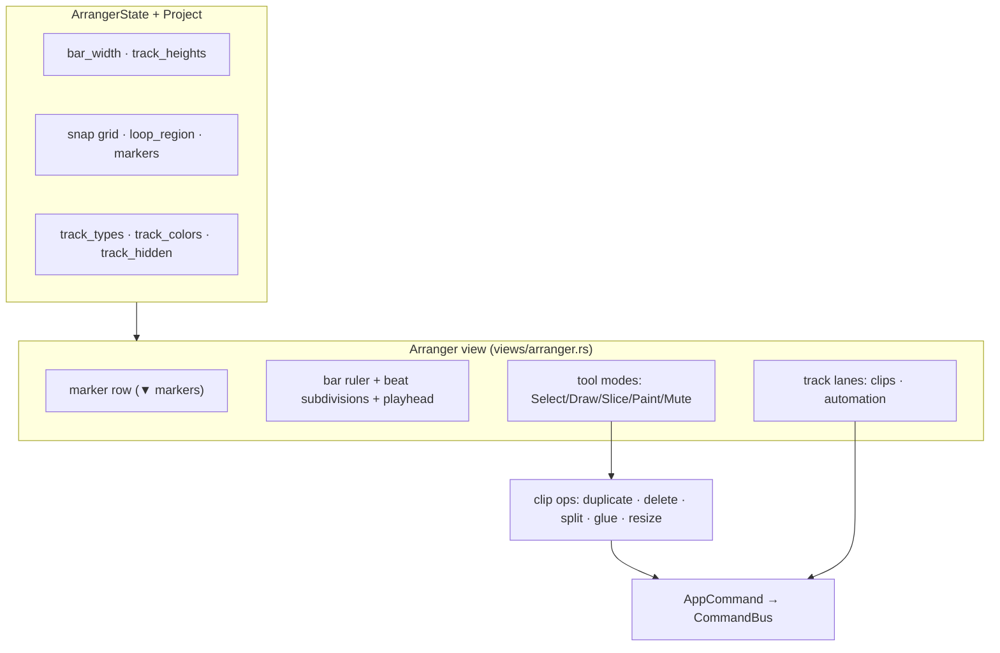

# Arranger

**Crate:** `seqterm-ui`  
**Module:** `views/arranger.rs`  
**Layer:** Frontend adapter

The Arranger is SeqTerm's song-composition view. It shows the project's pattern arrangement as a timeline of block clips, provides automation lane editing, loop region, timeline markers, and hosts the song-mode chain editor.



---

## View Layout

```
┌── Marker row ──────────────────────────────────────────────────────────────────┐
│  ▼intro       ▼drop                                                            │
├── Beat row (bar ruler + loop tint) ────────────────────────────────────────────┤
│  01···  05···  [I09···  13···  O17]··  21···  25···                            │
├── Track lanes (left: labels; right: clip blocks) ──────────────────────────────┤
│ AU│KICK01│████████████████████████████████████████████                        │
│ MI│BASS01│        ████████████████████████████                                │
│ DR│DRUMS1│────────────────  (hidden)                                          │
├── Automation lanes ────────────────────────────────────────────────────────────┤
│ BPM     ·····-·····-·····                                                     │
│ CH1.vol ∿∿∿∿∿∿∿∿∿∿∿∿∿∿∿∿∿                                                    │
├── Song transport + Chain editor ───────────────────────────────────────────────┤
│  ► PLAY  ■ STOP  ● REC  ↺ LOOP  SNAP:Bar  BPM 128.0  [Scene A: 4 bars]       │
└────────────────────────────────────────────────────────────────────────────────┘
```

The view has five sections rendered by `draw_arranger()`:

| Section | Rows | Description |
|---------|------|-------------|
| Marker row | 1 | `▼name` markers at bar positions |
| Beat row | 1 | Bar numbers, beat dots, loop region tinted green |
| Track lanes | flexible | One row per visible track (hidden tracks skipped) |
| Automation lanes | 9 | Per-lane parameter curves |
| Song transport | 9 | Transport controls + chain editor |

---

## Track Model

Each track in `project.tracks: Vec<Track>`:

```rust
pub struct Track {
    pub name: String,
    pub blocks: Vec<(u32, u32, String)>,  // (start_bar, length_bars, pattern_key)
    pub mute: bool,
}
```

Per-track metadata stored in `Project`:

| Field | Type | Description |
|-------|------|-------------|
| `track_types` | `HashMap<String, TrackKind>` | AU / MI / DR / GR / BS / AT |
| `track_colors` | `HashMap<String, u8>` | 0–7 palette index |
| `track_hidden` | `HashMap<String, bool>` | skip render when true |
| `track_heights` | `HashMap<String, u8>` | 2–6 rows (default 2) |

`TrackKind` variants: `Audio`, `Midi`, `Drum`, `Group`, `Bus`, `Auto`.

---

## Track Keyboard Navigation

| Key | Action |
|-----|--------|
| `↑` / `↓` | Select track |
| `←` / `→` | Scroll bar view (`bar_offset`) |
| `[` / `]` | Move clip column cursor |
| `H` | Toggle track hidden |
| `t` | Cycle track type (AU → MI → DR → GR → BS → AT) |
| `c` | Cycle track colour (8-colour palette) |
| `+` / `-` | Track height +1 / -1 (2–6 rows) |
| `Ctrl+scroll` | Horizontal zoom (`bar_width` 2–8 chars/bar) |
| `S` | Cycle snap grid: Off → Bar → ½Bar → ¼Bar → 1/8 → 1/16 → 1/32 |

---

## Clip Operations

A **clip cursor** (`arranger_state.selected_col`) marks the active bar column within the selected track.

| Key | Action |
|-----|--------|
| `Space` | Toggle clip in `multi_select` set |
| `Shift+↑` / `Shift+↓` | Extend multi-select to adjacent track row |
| `d` | Duplicate selected clip |
| `Del` / `Backspace` | Delete selected clip |
| `x` | Split clip at playhead position |
| `g` | Glue clip with next adjacent clip of the same pattern |
| `r` | Enter resize mode (`[`/`]` shrink/grow by 1 bar; `r`/`Esc` exits) |

---

## Loop Region

`project.loop_region: Option<(u32, u32)>` — loop in/out bars (inclusive).

| Key | Action |
|-----|--------|
| `I` | Set loop in at current bar |
| `O` | Set loop out at current bar |
| `L` | Toggle loop enabled |

When set, the beat row highlights the loop region in green and displays `[I` / `O]` markers.

---

## Timeline Markers

`project.markers: Vec<(u32, String)>` — (bar offset, label).

| Key | Action |
|-----|--------|
| `m` | Add marker at current bar (auto-named `M{n}`); if one exists there, remove it |

Markers appear as `▼name` in the dedicated marker row above the beat ruler.

---

## Automation Lanes

Automation lanes are stored in `project.automation: Vec<AutomationLane>`:

```rust
pub struct AutomationLane {
    pub name: String,
    pub target: String,  // e.g. "bpm", "channel.0.cc74"
    pub points: Vec<(u32, u8)>,  // (bar, value 0-127)
    pub enabled: bool,
}
```

`draw_automation_lanes()` renders each lane as a polyline. The scheduler calls `process_automation()` once per bar, interpolating linearly between surrounding points and applying the result as a MIDI CC, BPM change, or volume command.

### Target Syntax

| Target | Effect |
|--------|--------|
| `"bpm"` | Maps 0–127 → 20–300 BPM |
| `"channel.N.cc74"` | Sends CC 74 to slot N |
| `"channel.N.send_a"` | Aux send A level for slot N |
| `"channel.N.volume"` | Slot volume |

---

## ArrangerState

```rust
pub struct ArrangerState {
    pub section: usize,         // 0=tracks, 1=automation, 2=transport
    pub track_cursor: usize,    // selected track index
    pub lane_cursor: usize,     // selected automation lane
    pub bar_cursor: u32,        // current bar for operations
    pub bar_offset: u32,        // horizontal scroll offset
    pub selected_col: u32,      // clip column cursor within selected track
    pub multi_select: HashSet<(usize, u32)>,  // (track_idx, bar) set
    pub resize_mode: bool,      // true when in clip resize mode
    pub bar_width: u8,          // chars per bar (2–8, Ctrl+scroll)
    pub snap_grid: SnapGrid,    // Off/Bar/HalfBar/QuarterBar/…
}
```

---

## Mouse Support

| Area | Click behaviour |
|------|-----------------|
| Bar ruler | Set `bar_cursor` to clicked bar |
| Track lane block | Select track + set clip cursor |
| Marker row | Select nearest marker |
| Transport buttons | Same as keyboard shortcuts |
| Chain entry | Select entry |
| Automation point | Select lane; scroll adjusts value |

---

## Relationship to the Matrix

The Arranger and Matrix views share the same underlying data (`project.matrix`, `project.tracks`, `project.patterns`). The Matrix is the **live performance** view (clip launching, step editing); the Arranger is the **composition** view (linear arrangement, automation, song structure). Changes made in either view are immediately reflected in the other.

---

## Rational Arrangement Timeline (Phase 4–5)

The legacy bar-block arranger described above is superseded by a **rational-time
arrangement model** (`seqterm-core/src/arrangement.rs`), toggled in the Arranger
view with **`g`** (`ArrangerState.arrangement_mode`). It is additive: legacy
projects migrate into it on load (schema v3) and both representations coexist.

### Data model

```
Arrangement
├── tracks: Vec<ArrangementTrack>
│   ├── name, kind: TrackKind, color, mute/solo/arm/monitor
│   ├── source_row: Option<String>      // matrix row "A".."H" → instrument routing
│   ├── lanes: Vec<Lane>  → clips: Vec<Clip>
│   │     Clip { id, name, kind: {Pattern|Audio|Midi}, start, length,
│   │            content_offset, loop_enabled, color, muted }   // all RationalTime beats
│   └── automation: Vec<AutomationLane>  // beat-based breakpoints, 0..1, curves+modes
├── markers:  Vec<Marker>               // { beat, name, color }
├── regions:  Vec<Region>               // { start, end, name, color }
├── sections: Vec<Section>              // { start, end, name, color } — group clips
├── cycle:    Option<(start, end)>      // loop span (drives loop playback)
└── next_clip_id: u64                   // monotonic, never reused
```

All positions/lengths are exact [`RationalTime`] beats (Phase 2), so the timeline
is resolution-independent. Clip ids are stable for selection/undo.

### Playback & routing

A track plays through the instrument configured on its `source_row` matrix row
(source / MIDI-out / audio slot) — no separate instrument model. The realtime
path lives in `seqterm-engine/src/scheduler.rs`:

- `Arrangement::playback_hits(beat)` → routed, unmuted pattern clips active at
  `beat`; `fire_arrangement_clips` windows each clip's `to_events()` and emits
  `AudioNoteOn`/MIDI per hit (driven by `absolute_step`, the arrangement-only
  1/16 clock, independent of the matrix `current_step`).
- `process_arrangement_automation` evaluates each track's lanes and emits a CC to
  the routed instrument when the quantised value changes (dest→CC map: volume→7,
  pan→10, cutoff→74, resonance→71, reverb→91, chorus→93, `ccNN`).
- `maybe_loop_arrangement` wraps `absolute_step` back to the cycle start at the
  cycle end — loops the arrangement without touching the matrix transport.

### Editing model

Every edit is an undoable `AppCommand` (`Arrangement*`) routed through
`App::record_edit` (snapshot-based undo). Mouse editing (drag-move, Alt+drag
duplicate, Shift+click multi-select, minimap click-to-navigate) is driven through
the same `handle_mouse` dispatchers; geometry is hit-tested against cached panel
rects (`arranger_panel_rects`, `arr_overview_rect`). The timeline renders extra
ruler rows (MARKERS / REGIONS / SECTIONS / OVERVIEW) above/below the track lanes.

See `docs/guide/arrangement-editor.md` for the full keyboard/mouse reference, and
`docs/rational-storage.md` for the canonical-note storage decision.

### Known gaps (honest status)

Tracked in `docs/roadmap/STATUS.md`. Notable deferrals: arrangement **audio-clip
playback** (needs app-side audio-slot loading per clip), piano-roll **drag-move /
zoom** and timeline **zoom-to-fit** (hardcoded cell width — high regression risk),
**folder collapse/expand** and large-project **virtualization** (both need a
visible-track indirection), and the **`.stz`** arrangement bridge.
