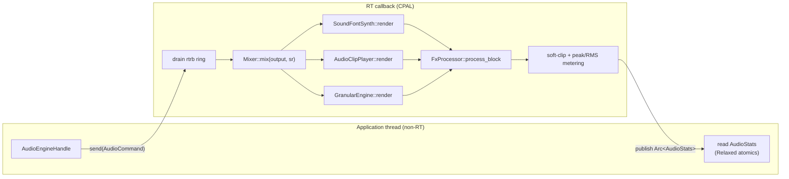

# Audio Engine

**Crate:** `seqterm-audio-engine`  
**Layer:** Infrastructure adapter

The audio engine owns everything that produces or transforms PCM samples. It exposes a non-realtime control handle (`AudioEngineHandle`) to the application layer and runs all hot-path work inside a CPAL callback.



---

## Module Map

```
seqterm-audio-engine/src/
├── lib.rs              Re-exports and start_default() convenience
├── engine.rs           AudioEngine + AudioEngineHandle (non-RT control)
├── cpal_backend.rs     CpalAudioBackend — CPAL stream + RT callback + AudioStats atomics
├── mixer.rs            Mixer — sums N AudioSource slots into stereo output; SpectrumAnalyzer
├── sf2_synth.rs        SoundFontSynth — oxisynth wrapper (256-voice polyphony)
├── audio_clip.rs       AudioClipPlayer — Symphonia decoder + trim/loop/pitch/reverse
├── granular/           GranularEngine — 32-voice granular synthesis
├── fx/                 25 FX processors (see FX Chain section)
├── lufs.rs             LufsIntegrator — K-weighting, 400ms blocks, 3s short-term, gated
├── spectrum.rs         SpectrumAnalyzer — 2048-pt FFT, 32 log bands, Hann window
├── events.rs           AudioCommand + AudioEngineEvent enums
├── assets.rs           AssetCache — path → decoded PCM cache
├── offline.rs          OfflineRenderer — mixdown + stem export to WAV
├── waveform_cache.rs   On-disk waveform band cache (~/.cache/seqterm/waveforms/)
└── skip_back.rs        SkipBackBuffer — fixed-size circular pre-roll buffer
```

---

## Realtime Architecture

```
Application thread                   RT callback (CPAL)
─────────────────                    ──────────────────
AudioEngineHandle                    AudioCallback::process()
  │                                    │
  ├─ send(AudioCommand) ──rtrb──►      ├─ drain rtrb ring
  │                                    ├─ Mixer::mix(output, sr)
  │                                    │   ├─ SoundFontSynth::render()
  │                                    │   ├─ AudioClipPlayer::render()
  │                                    │   ├─ GranularEngine::render()
  │                                    │   ├─ FxProcessor::process_block()
  │                                    │   └─ soft-clip + peak metering
  │                                    └─ publish stats via Arc<AudioStats>
  └─ read stats (Relaxed atomics) ◄────────────────────────────────────────
```

The ring buffer capacity is 1024 commands. Commands not consumed within one block are processed in the next; this is acceptable because command rate is bounded by UI frame rate (~60 Hz), far below the audio callback rate (~170 Hz at 256-frame buffer / 44.1 kHz).

---

## Mixer

`Mixer` holds up to **32 slots** (`MAX_SLOTS`). Each slot is a `MixerSlot`:

```rust
pub struct MixerSlot {
    pub source:   Option<Box<dyn AudioSource>>,
    pub volume:   f32,          // linear amplitude
    pub active:   bool,
    pub send_a:   f32,          // post-fader send → Bus A
    pub send_b:   f32,          // post-fader send → Bus B
    pub fx_chain: Vec<Box<dyn FxProcessor>>,  // pre-fader insert chain
}
```

Signal flow within `mix()`:

1. Each active slot calls `source.render(scratch, sr)`.
2. The slot's `fx_chain` processors run on the scratch buffer.
3. The scratch buffer is scaled by `slot.volume` and accumulated into the master sum.
4. Simultaneously, send levels scale the scratch into `bus_scratch[A]` and `bus_scratch[B]`.
5. Bus returns are added to the master sum (scaled by `bus_volumes[i]`, gated by `bus_muted[i]`).
6. `master_fx` chain (post-bus, pre-clip) runs on the master sum.
7. Soft-clip limiter: `tanh(x * 0.8) / 0.8` applied per sample.
8. Peak tracking: exponential decay `PEAK_DECAY = 0.98` per block; per-slot RMS via EMA; published to `AudioStats` atomics.
9. Pearson L/R correlation computed in-place, EMA-smoothed → `master_correlation` atomic.
10. LUFS: 400ms blocks fed to `LufsIntegrator` (K-weighting biquad, integrated gated) → 3 atomic floats (M/S/I).
11. Spectrum: master output fed to `SpectrumAnalyzer` → 32 `AtomicU32` band magnitudes.
12. If `waveform_slot >= 0`, left-channel samples of that slot are written into the ring buffer used by the live oscilloscope.

---

## SoundFontSynth

Wraps **oxisynth** with:

- **256-voice polyphony** (`MAX_VOICES = 256`), matching FluidSynth GM default.
- **GM initialisation** on `load_multi()`: CC7 (volume=100), CC10 (pan=64), CC91 (reverb=40), CC93 (chorus=0) sent on all 16 channels.
- **Multi-channel loading**: `load_multi(path, &[(ch, bank, preset)])` loads a single SF2 file and configures multiple MIDI channels in one synth instance, so all clips sharing the same `.sf2` path share one block of decoded sample memory.
- **Fade-out stop**: `stop()` queues a 50 ms linear fade-out and fires `AllNotesOff` on all channels before deactivating the slot.
- **Pitch bend**: `pitch_bend()` converts signed ±8192 to the unsigned 0–16383 range expected by oxisynth.

---

## AudioClipPlayer

Decodes audio files (WAV, FLAC, OGG, MP3) via **Symphonia** into a heap-allocated `Vec<f32>` PCM buffer at load time (non-RT). During playback:

- Reads from the pre-decoded buffer — no I/O in the callback.
- Supports **non-destructive trim**: `trim_start` / `trim_end` as fractions of total length.
- Supports **loop region** clamped within the trim window.
- **Pitch/speed shift**: integer semitone offset applied by resampling the read stride.
- **Reverse playback**: flag that reads the buffer backwards.
- **Normalize**: peak-normalises the decoded buffer once on load when the flag is set.

---

## GranularEngine

32-voice polyphonic granular synthesiser. Key parameters:

| Parameter | Description |
|-----------|-------------|
| `position` | Playback head as fraction of source (0.0–1.0) |
| `grain_size_ms` | Grain duration in milliseconds |
| `pitch_semitones` | Pitch transposition |
| `density` | Grains per second |
| `spray` | Random position jitter |
| `scan_mode` | `Linear` · `RandomWalk` · `Freeze` |
| `attack_pct` / `decay_pct` | Grain envelope shape |

The engine maintains a pool of pre-allocated grain structs. On each block it spawns new grains as the density schedule dictates and advances all active grains by the block size.

**Live input**: when a `live_link` is configured, the engine reads from a circular buffer filled by a mixer slot's rendered output instead of from a loaded sample.

---

## FX Chain

25 processors, all zero-allocation in `process_block()`. Each implements `FxProcessor`:
`process_block(buf, sr)`, `reset()`, `set_mix(wet)`, `name() -> &str`.

| Category   | Processor      | Description                                              |
|------------|----------------|----------------------------------------------------------|
| Dynamics   | Compressor     | Feed-forward peak, soft-knee, makeup; `.limiter()` preset |
|            | Gate           | Threshold + hold phase + range floor                     |
|            | Expander       | Downward/upward, threshold/ratio/attack/release/range    |
|            | SidechainDuck  | Amplitude-follower-based ducking                         |
| EQ/Filter  | ParametricEq   | 4-band biquad: HP · LowShelf · Peak · HighShelf/LP       |
|            | FilterBankFx   | 48-band graphic EQ                                       |
|            | Isolator       | 3-band SVF (bass/mid/treble), 48 dB/oct                  |
|            | Svf            | Topology-preserving state-variable filter (Simper 2013)  |
| Modulation | Chorus         | LFO-modulated multi-tap delay, stereo π-offset           |
|            | Flanger        | Short delay + feedback, optional stereo                  |
|            | Phaser         | 2–8 all-pass stages, LFO sweep                           |
| Time-based | DelayLine      | Stereo ping-pong delay, feedback, 1-pole LP damping      |
|            | Reverb         | Freeverb: 8 comb + 4 allpass (stereo)                    |
|            | GranularDelay  | Granular feedback delay                                  |
|            | Looper         | RT loop recorder: Idle/Record/Play/Overdub               |
| Colour     | Bitcrusher     | Bit-depth quantisation + sample-hold decimation          |
|            | SoftClipper    | `tanh` waveshaper with drive                             |
|            | TubeSaturation | Asymmetric triode waveshaper + HP tone                   |
|            | Cassette       | Lo-fi tape saturation                                    |
|            | VinylSim       | LFO wow/flutter + LCG crackle noise                      |
| Utility    | Gain           | Utility gain stage (dB)                                  |
|            | Pan            | Linear + constant-power law panning                      |
|            | StereoWidener  | M/S processing (0=mono, 1=unity, 2=wide)                 |
|            | PhaseInvert    | Per-channel polarity flip                                |
|            | MonoMaker      | Sum L+R to mono                                          |

---

## AudioStats (Lock-Free UI Read)

The RT callback publishes metering data through `Arc<AudioStats>`:

```rust
struct AudioStats {
    dsp_load_ppm:       AtomicU32,              // CPU % × 10000
    slot_peaks:         Box<[AtomicU32]>,        // f32 bits, per slot
    slot_rms:           Box<[AtomicU32]>,        // f32 EMA RMS, per slot
    master_peak:        AtomicU32,              // f32 bits, L+R max
    master_rms_l:       AtomicU32,              // f32 EMA RMS, L
    master_rms_r:       AtomicU32,              // f32 EMA RMS, R
    master_lufs_m:      AtomicU32,              // LUFS momentary
    master_lufs_s:      AtomicU32,              // LUFS short-term (3s)
    master_lufs_i:      AtomicU32,              // LUFS integrated gated
    master_correlation: AtomicU32,              // Pearson L/R, –1.0..1.0
    spectrum_bands:     Box<[AtomicU32]>,        // 32 × f32 band magnitudes
    waveform_slot_id:   AtomicI32,              // -1 = none
    waveform_buf:       Box<[AtomicU32]>,        // 1024 f32 samples (L channel)
    waveform_write_pos: AtomicUsize,            // monotonic counter
}
```

All reads use `Ordering::Relaxed` — the UI only needs eventual consistency for metering data.

---

## Asset Cache

`AssetCache` maps file paths to decoded PCM data. On a cache hit the engine skips re-decoding. The cache is held in an `Arc<AssetCache>` shared between the control thread and background loader threads. Cache entries are never evicted automatically; the application layer calls `unload_slot()` to free memory.

---

## Offline Rendering

`render_offline_mixdown(project, config, path)` and `render_offline_stem(...)` in `offline.rs` drive the engine without a CPAL stream, advancing time manually and accumulating output into a WAV file. They share the same `Mixer` + `SoundFontSynth` path as the live engine, so the offline bounce is sonically identical to live playback.
