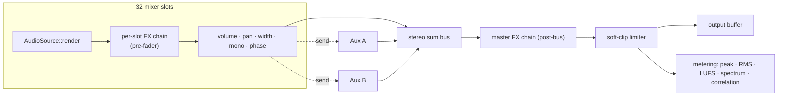

# Mixer

**Crate:** `seqterm-audio-engine`  
**Module:** `mixer.rs`, `fx/`  
**Layer:** Realtime (called exclusively from the CPAL audio callback)

The mixer accumulates audio from up to 32 independent sources into a single stereo output, applies per-slot and master FX, routes to aux buses, and publishes metering data.



---

## Data Model

```
Mixer
├── slots[0..31]       MixerSlot (SF2 synth, AudioClipPlayer, or GranularEngine)
├── master_volume      f32  (linear amplitude, default 1.0)
├── bus_scratch[A,B]   Vec<f32>  (aux bus accumulation buffers)
├── bus_volumes[A,B]   f32
├── bus_muted[A,B]     bool
├── master_fx          Vec<Box<dyn FxProcessor>>  (post-bus, pre-clip)
├── slot_peaks[0..31]  f32  (peak with PEAK_DECAY=0.98 exponential decay)
├── slot_rms[0..31]    f32  (EMA RMS per slot, α=0.05)
├── master_peak[L,R]   f32
├── master_rms[L,R]    f32
├── lufs               LufsIntegrator  (K-weighted, 400ms blocks)
├── correlation        f32  (Pearson L/R, EMA-smoothed)
├── spectrum           SpectrumAnalyzer  (2048-pt FFT, 32 log bands)
├── waveform_slot      i32   (-1 = off, ≥0 = capture this slot)
└── waveform_buf       Vec<f32>  (1024-sample ring, L channel)
```

---

## Signal Flow

```
for each active slot:
    source.render(scratch)          → raw PCM into scratch buffer
    for fx in slot.fx_chain:
        fx.process_block(scratch)   → in-place transform
    master_sum += scratch × volume
    bus_A      += scratch × send_a
    bus_B      += scratch × send_b
    update slot_peaks[i]            → PEAK_DECAY = 0.98 per block
    update slot_rms[i]              → EMA α = 0.05

master_sum += bus_A × bus_vol_A  (if not muted)
master_sum += bus_B × bus_vol_B  (if not muted)

for fx in master_fx:
    fx.process_block(master_sum)    → master bus insert chain

soft_clip(master_sum)               → tanh(x × 0.8) / 0.8 per sample
update master_peak, master_rms
compute Pearson L/R correlation     → EMA-smoothed → master_correlation
feed master output to LufsIntegrator → 400ms blocks, K-weighting
feed master output to SpectrumAnalyzer → 2048-pt FFT, 32 log bands

if waveform_slot >= 0:
    capture L samples into waveform_buf ring
```

The method signature is `mix(&mut self, output: &mut [f32], sample_rate: u32)`. The `output` slice is the CPAL output buffer (interleaved L/R). No allocation occurs during `mix()`; all scratch and bus buffers are pre-sized at `Mixer::new(max_block)`.

---

## Slot Management

Slots are addressed by a stable `slot_id: u32` (index into `slots[0..31]`). The non-RT engine assigns IDs when clips are loaded:

```
AudioCommand::LoadSf2     { slot_id, path, bank, preset }
AudioCommand::LoadAudioFile { slot_id, path, looping, original_bpm }
AudioCommand::UnloadSlot  { slot_id }
```

Loading happens on a background thread (non-RT). The loaded `Box<dyn AudioSource>` is shipped back through a separate `(slot_id, source)` install channel and installed into the mixer slot at the top of the next audio callback — the only point where the RT thread touches heap allocation (installing the box pointer).

---

## Per-Slot FX Chain

Each `MixerSlot.fx_chain` is a `Vec<Box<dyn FxProcessor>>` that runs **pre-fader** (before volume scaling). The chain is replaced atomically via:

```
AudioCommand::SetSlotFxChain { slot_id, chain: Vec<Box<dyn FxProcessor>> }
AudioCommand::ClearSlotFx    { slot_id }
```

Pre-constructed processors are sent through the command channel — no allocation happens during processing.

---

## Master FX Chain

`Mixer.master_fx` is a post-bus, pre-clip chain. It processes the fully summed stereo output after all bus returns have been mixed in. Useful for mastering-style processing: limiting, EQ, stereo width. Replaced via `AudioCommand::SetMasterFxChain`.

---

## Aux Buses

Two buses (A and B) are available. Each slot can send to either or both via post-fader send levels:

```
AudioCommand::SetSlotSends { slot_id, send_a: f32, send_b: f32 }
```

Bus return volumes and mute state:

```
AudioCommand::SetBusVolume { bus_idx: usize, volume: f32 }
AudioCommand::SetBusMuted  { bus_idx: usize, muted: bool  }
```

Buses can model traditional effects sends (reverb return, delay return) or parallel compression sidechains.

---

## Peak Metering

Peak levels use **exponential decay** with `PEAK_DECAY = 0.98` applied per block. For a 256-frame block at 44.1 kHz:

```
time_per_block ≈ 5.8 ms
decay per second ≈ 0.98^(1000/5.8) ≈ 0.98^172 ≈ 0.031
-30 dB release in ≈ 172 blocks ≈ 1 s
```

This gives the classic "fast attack, slow release" VU-meter feel. Peaks are published to `AudioStats` atomics using `Relaxed` ordering — the UI reads them once per frame.

## RMS Metering

Per-slot and master L/R RMS are computed with an **EMA** (exponential moving average, α = 0.05) applied each block:

```
rms_ema = α × rms_block + (1 − α) × rms_ema
```

Published as `slot_rms` and `master_rms_l/r` atomics. UI shows a teal ▬ bar row in each channel strip when strip height ≥ 4.

## LUFS Metering

`LufsIntegrator` (in `lufs.rs`) implements ITU-R BS.1770-4:

- **K-weighting**: two-stage biquad (high-shelf pre-filter + high-pass RLB filter), coefficients recomputed dynamically for the current sample rate.
- **Block integration**: 400 ms blocks (75% overlap), mean-square per block.
- **Short-term**: sliding 3 s window of recent blocks.
- **Integrated (gated)**: absolute gate at −70 LUFS, relative gate at −10 dB below ungated mean.
- Published as three `AtomicU32` floats: `master_lufs_m`, `master_lufs_s`, `master_lufs_i`.
- UI shows M / S / I rows on the MASTER R strip.

## Correlation Meter

Pearson L/R correlation is computed per block inside `mix()`:

```
φ = Σ(L×R) / sqrt(Σ(L²) × Σ(R²))
```

Result is EMA-smoothed (α = 0.1) and published as `master_correlation` (`AtomicU32` f32 bits).  
UI colour-codes: green ≥ 0.5, yellow 0–0.5, red < 0 (out-of-phase).

## Spectrum Analyzer

`SpectrumAnalyzer` (in `spectrum.rs`) runs on the master output after soft-clip:

- 2048-point FFT via `rustfft`, Hann window applied per frame.
- Input ring buffer accumulates blocks; FFT fires when full.
- 32 log-spaced frequency bands, magnitude in dBFS, EMA-smoothed per band (α = 0.15).
- Published as 32 × `AtomicU32` (f32 bits) in `AudioStats.spectrum_bands`.
- UI polls once per frame → `App.master_spectrum` → `draw_spectrum_overlay` bar chart on MASTER L strip.

---

## Live Oscilloscope Capture

When `waveform_slot >= 0`, the mixer writes left-channel post-FX samples of that slot into a 1024-element ring buffer. The write index is `waveform_pos % WAVE_LEN`. The UI reads the ring buffer at 60 Hz, resamples it to the display width, and renders a bipolar waveform centred on zero.

The slot ID to capture is set by `AudioCommand` passthrough from `AudioEngineHandle::set_waveform_slot()`.

---

## Volume Units

Slot and master volumes are linear amplitudes, not dB. The conversion for the UI:

```
dBFS = 20 × log10(amplitude)
amplitude = 10^(dBFS / 20)
```

The mixer itself does not convert; the application layer is responsible for converting user-facing dB values before sending `SetSlotVolume` or `SetMasterVolume`.

---

## Live Links (Granular Engine)

`Mixer.live_links: Vec<(source_slot_idx, granular_slot_idx)>` connects a rendered mixer slot as the live audio input of a granular engine slot. After the source slot renders its scratch buffer, the mixer copies those samples into the granular engine's live ring buffer. This enables real-time granular processing of any audio source without a separate recording pass.

---

## FX Processor Catalogue

All 25 processors implement `FxProcessor`:

```rust
pub trait FxProcessor: Send {
    fn process_block(&mut self, buf: &mut [f32], sample_rate: u32);
    fn reset(&mut self);
    fn set_mix(&mut self, wet: f32);
    fn name(&self) -> &str { "FX" }  // default impl
}
```

| Name | Category | Key Parameters |
|------|----------|----------------|
| `Compressor` | Dynamics | threshold, ratio, attack, release, makeup, knee; `.limiter()` preset |
| `Gate` | Dynamics | threshold, attack, hold, release, floor |
| `Expander` | Dynamics | threshold, ratio, attack, release, range; upward/downward mode |
| `SidechainDuck` | Dynamics | threshold, attack_ms, release_ms |
| `ParametricEq` | EQ/Filter | 4 bands: HP · LowShelf · Peak · HighShelf/LP (freq, gain, Q) |
| `FilterBankFx` | EQ/Filter | 48-band graphic EQ, per-band gain (dB) |
| `Isolator` | EQ/Filter | lo_gain, mid_gain, hi_gain (3-band SVF, 48 dB/oct) |
| `Svf` | EQ/Filter | mode (LP/HP/BP/Notch), cutoff, resonance |
| `Chorus` | Modulation | rate, depth, voices, stereo width |
| `Flanger` | Modulation | rate, depth, feedback, stereo |
| `Phaser` | Modulation | rate, depth, stages (2–8), feedback |
| `DelayLine` | Time-based | delay_ms, feedback, pan (ping-pong) |
| `Reverb` | Time-based | room_size, damping, width (Freeverb) |
| `GranularDelay` | Time-based | grain_ms, feedback, density |
| `Looper` | Time-based | state (Idle/Record/Play/Overdub) |
| `Bitcrusher` | Colour | bits (1–16), rate_divisor |
| `SoftClipper` | Colour | drive |
| `TubeSaturation` | Colour | drive, tone |
| `Cassette` | Colour | drive, tone, flutter |
| `VinylSim` | Colour | crackle_density, flutter_rate, wow_depth |
| `Gain` | Utility | gain_db |
| `Pan` | Utility | pan (−1.0 L … 0.0 C … +1.0 R); linear + constant-power mode |
| `StereoWidener` | Utility | width (0=mono, 1=unity, 2=wide); M/S processing |
| `PhaseInvert` | Utility | invert_l, invert_r |
| `MonoMaker` | Utility | (no parameters; sums L+R → mono) |
