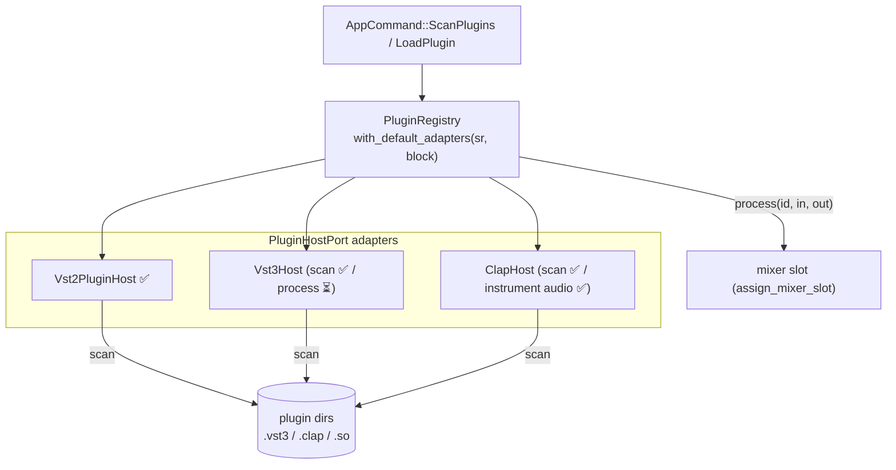

# Plugin Hosting

**Crate:** `seqterm-plugin-vst2`  
**Port:** `seqterm-ports::plugin::PluginHostPort`  
**Layer:** Infrastructure adapter

SeqTerm hosts external plugins behind a single `PluginHostPort` trait, keeping the domain free of any plugin-ABI specifics. The application's `PluginRegistry` aggregates one adapter per format and drives them uniformly (`scan` / `instantiate` / `process` / `destroy`).

**Adapter status:**

| Format | Adapter | Scan | Instantiate | RT process |
|--------|---------|------|-------------|-----------|
| VST2 | `Vst2PluginHost` | ✅ | ✅ | ✅ (inline ABI via `libloading`) |
| VST3 | `Vst3Host` | ✅ | ✅ | ⏳ needs Steinberg VST3 COM SDK |
| CLAP | `ClapHost` | ✅ | ✅ | ✅ instrument audio + note/CC/pitch-bend via `clack-host` (`clap` feature) |
| AU | `AuInstrument` | macOS | scaffold | ⏳ macOS + CoreAudio |

`PluginRegistry::with_default_adapters()` registers every adapter compiled in — VST2 by default, VST3/CLAP behind the `vst3` / `clap-host` features.



---

## Module Map

```
seqterm-plugin-vst2/src/
├── lib.rs        Vst2PluginHost (implements PluginHostPort) + Vst2Instance
└── vst2_abi.rs   Raw VST2 C ABI definitions (AEffect, opcodes, callbacks)
```

---

## Architecture

```
Application
  │
  └─ PluginHostPort (trait)
        │
        └─ Vst2PluginHost
              ├─ scan(dir)          discovers .so / .vst / .dll files
              ├─ instantiate(id, sr, bs)
              │    └─ Library::new(path)     libloading
              │    └─ VSTPluginMain(callback) → AEffect*
              │    └─ dispatch(effOpen, ...)
              │    └─ dispatch(effSetSampleRate, ...)
              │    └─ dispatch(effSetBlockSize, ...)
              └─ Vst2Instance
                    ├─ AEffect*       raw pointer into the .so
                    └─ Arc<Library>   keeps the shared library alive
```

---

## Plugin Discovery

`Vst2PluginHost::scan(dir: &Path) -> Vec<PluginDescriptor>` scans a directory recursively for files matching the platform extension (`.so` on Linux, `.dylib`/`.vst` on macOS, `.dll` on Windows). For each candidate:

1. `libloading::Library::new(path)` loads the shared object.
2. Attempts to resolve `VSTPluginMain` (fallback: `main`).
3. Calls the entry point with a dummy host callback to get the `AEffect*`.
4. Reads `AEffect.numInputs`, `numOutputs`, `numParams`, `flags`, and `uniqueID`.
5. Calls `dispatch(effGetProductString, ...)` to get the plugin name.
6. Returns a `PluginDescriptor` with the collected metadata.

Plugins that fail to load (missing symbol, crash, incompatible ABI) are skipped with a warning log.

---

## Instantiation

```rust
fn instantiate(&self, id: u32, sample_rate: u32, block_size: u32)
    -> Result<Arc<Mutex<dyn PluginInstance>>>
```

1. Loads the `.so` for the given plugin ID.
2. Calls `VSTPluginMain(host_callback)` to create a new plugin instance.
3. Dispatches: `effOpen`, `effSetSampleRate`, `effSetBlockSize`, `effMainsChanged(1)`.
4. Returns `Arc<Mutex<Vst2Instance>>`.

---

## Host Callback

VST2 plugins call back into the host through a C function pointer:

```rust
unsafe extern "C" fn host_callback(
    _effect: AEffectPtr,
    opcode: i32,
    _index: i32,
    _value: isize,
    _ptr: *mut c_void,
    _opt: c_float,
) -> isize
```

Currently responds to:

| Opcode | Response |
|--------|----------|
| `audioMasterVersion` | `2400` (VST 2.4) |
| `audioMasterCurrentId` | `0` |
| `audioMasterIdle` | `0` |
| `audioMasterGetSampleRate` | `48000` |
| `audioMasterGetBlockSize` | `512` |
| `audioMasterCanDo` | `0` (not supported) |

Other opcodes return `0`. This is sufficient for most VST2 instruments and effects that only query basic host capabilities.

---

## Processing

```rust
fn process(&self, instance: &Vst2Instance, in: &[&[f32]], out: &mut [&mut [f32]])
```

Calls the plugin's `processReplacing` function (`AEffect.processReplacing`), passing pre-allocated input and output channel buffers.

> **RT Safety Warning:** VST2 plugins are not guaranteed to be realtime-safe. `processReplacing` may allocate memory, acquire locks, or perform I/O. SeqTerm currently calls plugin processing from a non-RT context. If a known-safe plugin must run in the audio callback, it is the application's responsibility to verify RT safety.

---

## Parameter Automation

```rust
fn set_param(&self, instance, index: u32, value: f32)   // 0.0–1.0
fn get_param(&self, instance, index: u32) -> f32
```

VST2 parameter values are normalised to `[0.0, 1.0]`. Mapping to human-readable ranges is the plugin's responsibility via `getParameterDisplay`.

---

## PluginHostPort Trait

Defined in `seqterm-ports::plugin`:

```rust
pub trait PluginHostPort: Send + Sync {
    fn scan(&self, dir: &Path) -> Vec<PluginDescriptor>;
    fn instantiate(&self, id: u32, sample_rate: u32, block_size: u32)
        -> Result<Arc<Mutex<dyn PluginInstance>>>;
    fn describe(&self, id: u32) -> Option<PluginDescriptor>;
}
```

`PluginDescriptor` carries:

```rust
pub struct PluginDescriptor {
    pub id:           u32,
    pub name:         String,
    pub kind:         PluginKind,       // Instrument | Effect
    pub num_inputs:   u32,
    pub num_outputs:  u32,
    pub num_params:   u32,
    pub path:         PathBuf,
}
```

---

## Plugin Registry

`seqterm-application::PluginRegistry` is the application-layer wrapper around `PluginHostPort`. It caches scan results in memory and provides the UI with the list of available plugins for the plugin browser modal.

---

## Current Limitations

| Feature | Status |
|---------|--------|
| VST2 instruments | Supported |
| VST2 effects | Supported |
| VST3 | Planned (Phase 3) |
| CLAP instruments | Supported via `clack-host` (`clap` feature) — note on/off + velocity → stereo audio. Validated against Surge XT (see `tests/clap_runtime.rs`, `examples/clap_validate.rs`) |
| CLAP CC / pitch-bend | Supported — CC and channel pitch-bend sent as raw MIDI 1.0 events (`MidiEvent`) alongside the typed note ports |
| CLAP polyphonic expression | Supported — each note gets a unique `note_id`; in MPE mode per-channel pitch-bend → `Tuning`, CC74 → `Brightness`, channel pressure → `Pressure` `NoteExpressionEvent`s targeting that voice. Enabled per clip via `AudioCommand::SetSlotMpe` (driven from the clip's `MpeZone`) |
| CLAP plugin state | Supported — the CLAP `state` extension (via `clack-extensions`) saves/restores a plugin's opaque preset/parameter blob. Captured into `Project.plugin_state` on save (`AudioCommand::SaveSlotState`), restored at build (`AudioSynthPort::load_state`). Validated: Surge XT round-trips 50 KB of state byte-identically |
| AU (macOS) | Planned (Phase 3) |
| RT-safe plugin processing | Not enforced — plugin-dependent |
| Plugin state save/restore | CLAP and VST2 supported; VST3 ready (registry hook, pending its SDK) |
| MIDI 2.0 per-note controllers | Requires physical MIDI 2.0 device |

Hosted-plugin state is persisted in `Project.plugin_state` (keyed by clip_key) via two capture sources: the live audio slot (CLAP/LV2 sounding sources, `AudioCommand::SaveSlotState`) and the plugin registry (`PluginHostPort::get_state` — VST2's `effGetChunk`, and any host that implements it). It is restored at build time — CLAP audio sources through `AudioSynthPort::load_state` (before the source reaches the audio thread), registry instances through `PluginRegistry::set_state` after `instantiate`. For `.stz` archives the bridge writes each blob to `plugins/state/{clip_key}.state` (`AssetType::PluginState`) and reads it back in `to_core`, so plugin presets/parameters survive both `.json`/`.seqterm` and `.stz` round-trips.
