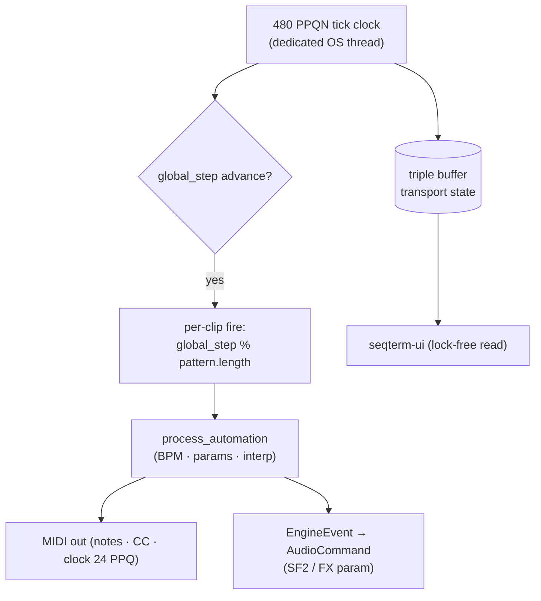

# Scheduler

**Crate:** `seqterm-engine`  
**Layer:** Infrastructure adapter (realtime-adjacent, not the audio callback)

The scheduler is the timing heart of SeqTerm. It runs on a dedicated OS thread and drives the global step clock, fires MIDI notes and audio engine events at sub-step precision, and publishes transport state to the UI via a triple buffer.



---

## Module Map

```
seqterm-engine/src/
├── lib.rs           PlaybackEngine — public handle for the application layer
├── scheduler.rs     Scheduler — the clock loop and note dispatch
├── transport.rs     TransportState — position + timing math
└── events.rs        EngineCommand + EngineEvent enums
```

---

## Clock Resolution

```
BPM 128, PPQN 480
  → 1 quarter note = 468 750 µs
  → 1 PPQN tick    = 976 µs   (~1 ms)
  → 1 sixteenth-note step = 120 ticks = 117 ms
```

SeqTerm uses **480 PPQN** — the same resolution as a standard MIDI file and the default FluidSynth engine. This gives approximately 1 ms tick granularity at 120 BPM, enough for perceptible micro-timing differences and natural swing feel.

The clock loop in `Scheduler::run()` is a spin-sleep hybrid:

```
loop {
    drain commands (non-blocking)
    if elapsed >= tick_duration:
        process_tick()
    else:
        sleep(remaining - 100 µs guard)
}
```

The 100 µs guard prevents overshooting by giving the OS scheduler a small window to wake up in time.

---

## Transport State

`TransportState` carries all position information:

| Field | Description |
|-------|-------------|
| `bpm` | Beats per minute (20.0–300.0) |
| `ppqn` | Pulses per quarter note (fixed at 480) |
| `current_step` | Global 16th-note step counter (never resets on loop) |
| `current_bar` | Bar number (increments every 16 steps) |
| `current_tick` | Tick within the current step (0–119 at 128 BPM) |
| `elapsed_ticks` | Monotonic absolute tick count since last Play |
| `playing` / `paused` / `recording` | Transport mode flags |

`tick_duration_us()` converts BPM + PPQN to microseconds per tick:

```
tick_us = 60_000_000 / (bpm × ppqn)
```

---

## Step Processing

`process_tick()` is called once per tick (every ~1 ms at 128 BPM):

1. Increment `elapsed_ticks` and `current_tick`.
2. Call `dispatch_pending_notes()` — fires any micro-shifted NoteOns/NoteOffs whose tick has arrived.
3. Check if this tick is a step boundary (`current_tick % (ppqn/4) == 0`).
4. If step boundary: call `fire_all_clips(global_step)`, advance `current_step`, check bar advance.
5. Publish `TransportState` to the triple buffer (lock-free UI read).

---

## Polymeter Note Firing

`fire_all_clips()` iterates every enabled clip in `project.matrix`. For each clip:

```
let pos = global_step % pattern.length;   // independent per-pattern phase
```

No pattern is forced to align to a common bar. A 7-step pattern and a 16-step pattern diverge and converge independently — true polymeter.

### Audio-engine lookahead

SF2 and AudioFile clips need their NoteOn event to arrive at the audio callback **before** the output buffer is filled, to compensate for the output latency introduced by the audio buffer size. The lookahead offset is:

```
lookahead_steps = round(buffer_latency_ms / step_ms)
audio_pos = (global_step + lookahead_steps) % pattern.length
```

`SetAudioLatency` recalculates this whenever the audio backend reports its buffer configuration.

---

## Sub-Step Precision

Two vectors hold deferred events:

**`pending_note_ons`** — NoteOns deferred by a positive micro-shift (`note.micro`). Each entry carries the absolute `at_tick` when it should fire.

**`pending_note_offs`** — NoteOffs scheduled by gate time. Gate duration is `note.gate / 100 × ticks_per_step` ticks.

Both are dispatched at the top of every `process_tick()` call by comparing `entry.at_tick <= elapsed_ticks`.

Micro-shift range: ±99% of one step. At 128 BPM this is ±116 ms — enough to cover any realistic swing or humanisation offset.

---

## MIDI Routing

Each clip carries an optional `midi_out` port name. The scheduler resolves this against `midi_ports: HashMap<String, flume::Sender<Vec<u8>>>` and sends raw MIDI bytes:

```
NoteOn:   0x90 | ch, note, vel
NoteOff:  0x80 | ch, note, 0
PitchBend: 0xE0 | ch, lsb, msb
CC:        0xB0 | ch, cc, val
```

The MIDI output threads (one per destination) read from their `flume::Receiver<Vec<u8>>` and call the underlying `midir` output port.

### MPE support

When a clip has an `mpe_zone`, the scheduler allocates independent MIDI channels per note via `MpeChannelMap`. Each NoteOn fires per-note pitch bend and pressure before the NoteOn itself; NoteOff releases the channel back to the pool.

---

## Audio Engine Events

When a clip's source is `PatternSource::Sf2` or `PatternSource::AudioFile`, the scheduler does not send MIDI bytes. Instead it fires `EngineEvent` variants that the application layer translates to `AudioCommand`:

| EngineEvent | Translated to |
|-------------|---------------|
| `AudioNoteOn { slot_id, ch, note, vel }` | `AudioCommand::NoteOn` |
| `AudioNoteOff { slot_id, ch, note }` | `AudioCommand::NoteOff` |
| `AudioControlChange { slot_id, ch, cc, val }` | `AudioCommand::ControlChange` |
| `AudioClipTrigger { slot_id }` | `AudioCommand::PlayAudioClip` |

The `slot_id` is a stable index into the audio engine's mixer slot array, assigned when `rebuild_audio_slots()` maps clip keys to mixer slots.

---

## MIDI Clock Output

When `midi_clock_out` is enabled, the scheduler sends:

- `0xF8` (Clock) every `ppqn / 24` ticks — exactly 24 pulses per quarter note, conforming to MIDI spec.
- `0xFA` (Start) on Play.
- `0xFC` (Stop) on Stop.

Clock messages are sent to all ports in `clock_ports`, a separate sender list from the note routing map.

---

## Song-Mode Chain

`chain_mode` activates the pattern chain defined in `project.chain`. The scheduler tracks `chain_pos` (current entry) and `chain_bars` (bars elapsed in the current entry). On each bar advance it calls `advance_chain()`, which increments `chain_bars` and, when the entry's bar count is reached, advances `chain_pos` and fires `EngineEvent::ChainAdvanced { chain_pos, scene_idx }`. The UI uses this event to update the active scene highlight in the Arranger view.

---

## Command Interface

Commands arrive from the application layer over `flume::Receiver<EngineCommand>`:

| Command | Effect |
|---------|--------|
| `Play` | Set `playing = true`; send MIDI Start if clock enabled |
| `Stop` | Flush pending NoteOffs; reset position; send MIDI Stop |
| `Pause` | Flush NoteOffs; freeze position |
| `Rewind` | Reset position; keep play state |
| `SetBpm(f64)` | Update BPM; fires `BpmChanged` event |
| `SetAudioSlots(map)` | Replace clip-key → slot-id mapping |
| `SetAudioLatency { buffer_size, sample_rate }` | Recalculate lookahead |
| `SwapProject(Arc<Mutex<Project>>)` | Hot-swap project reference |
| `SetChainMode(bool)` | Enable/disable song-mode chain following |

`Tick` (used in tests) forces one `process_tick()` call synchronously from the caller's thread.
