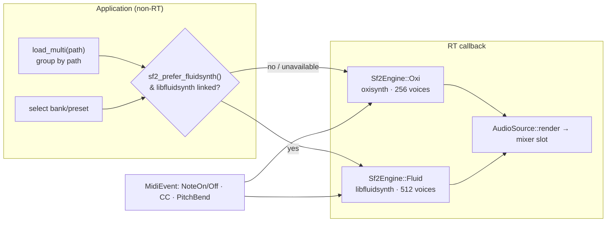

# SF2 Engine

**Crate:** `seqterm-audio-engine`  
**Module:** `sf2_synth.rs`  
**Layer:** Realtime (called from the CPAL audio callback via `AudioSource::render()`)

SeqTerm's SF2 engine renders General MIDI-compatible instruments and drum kits inside the audio callback. `SoundFontSynth` is engine-agnostic: it drives **either** of two interchangeable sample engines, chosen at load time:

| Engine | Crate / feature | When used | Notes |
|--------|-----------------|-----------|-------|
| **oxisynth** (default) | `oxisynth` (pure Rust) | Always available | 256-voice, no native deps |
| **FluidSynth — embedded** | `seqterm-fluidsynth` → FluidLite, feature `fluidsynth` | Selected **and** built with `--features fluidsynth` | 512-voice, reverb/chorus, SF2+SF3; **statically compiled, no external libraries** |
| **FluidSynth — system** | `seqterm-fluidsynth` → `libfluidsynth`, feature `fluidsynth-system` | Selected **and** built with `--features fluidsynth-system` | Full FluidSynth 2.x; dynamically links libfluidsynth |

Both render into SeqTerm's own buffers and flow through the normal mixer / FX chain — FluidSynth is used purely as a sample engine, never as a standalone audio server.



## Selecting the engine

The engine is a process-wide preference, consulted by `SoundFontSynth::load_multi()`:

- **Settings UI** — *Audio Settings → SF2 engine* (`oxisynth` / `fluidsynth`).
- **Config file** — `audio.sf2_backend` in the persisted settings.
- **Env var** — `SEQTERM_SF2_BACKEND=fluidsynth` (used when no explicit preference was set).
- **API** — `seqterm_audio_engine::set_sf2_prefer_fluidsynth(bool)`.

If FluidSynth is requested but the build lacks the `fluidsynth` feature (or libfluidsynth fails to load), `SoundFontSynth` logs a warning and transparently falls back to oxisynth — playback never goes silent.

## Building with FluidSynth

### Embedded (recommended) — `--features fluidsynth`

The synthesis core is **FluidLite** (FluidSynth with GLib and all OS/driver code
removed), whose bundled C is compiled straight into the binary by the `cc` crate.
There is **no system library, no GLib, no `pkg-config`, no `bindgen`** — the same
command works on every platform and the only requirement is the C compiler the
toolchain already uses:

```sh
# Linux · macOS · Windows · Raspberry Pi — identical
cargo build -p seqterm-app --features fluidsynth
```

The output binary has no dynamic dependency on `libfluidsynth`
(`ldd target/.../seqterm` shows none). SF2 **and** SF3 (Vorbis-compressed) are
supported via a bundled `stb_vorbis`, still with zero external deps.

### System libfluidsynth — `--features fluidsynth-system`

For full FluidSynth 2.x via dynamic linking. `seqterm-fluidsynth`'s `build.rs`
resolves the library in this order: `FLUIDSYNTH_LIB_DIR` env override → `pkg-config`
→ bare `-lfluidsynth`.

```sh
sudo apt install libfluidsynth-dev      # Linux / Raspberry Pi OS (arm64/armhf too)
sudo dnf install fluidsynth-devel       # Fedora
brew install fluid-synth                # macOS (Intel & Apple Silicon)
vcpkg install fluidsynth                # Windows — then:
set FLUIDSYNTH_LIB_DIR=C:\vcpkg\installed\x64-windows\lib

cargo build -p seqterm-app --features fluidsynth-system
```

> The default build (neither feature) needs **no** native library —
> `seqterm-fluidsynth` compiles to a silent stub, so CI and contributors are unaffected.

---

## Architecture

```
Application layer (non-RT)          Realtime callback
───────────────────────────          ─────────────────
AudioCommand::NoteOn ──rtrb──►       SoundFontSynth::note_on()
AudioCommand::NoteOff ─rtrb──►       SoundFontSynth::note_off()
AudioCommand::ControlChange ─►       SoundFontSynth::control_change()
                                     SoundFontSynth::render(output, sr)
                                       └─ engine.write/render_into((l, r))
                                            [Sf2Engine::Oxi | Sf2Engine::Fluid]
                                       └─ apply fade-out envelope
                                       └─ interleave L/R → output
```

Loading is non-RT: `SoundFontSynth::load_multi()` reads the `.sf2` file, decodes sample data, and instantiates an `oxisynth::Synth`. The fully-constructed synth is then installed into the mixer slot via the `install_rx` channel — the only point where a heap allocation enters the RT path.

---

## Polyphony

```rust
const MAX_VOICES: u16 = 256;
```

256 simultaneous voices, matching FluidSynth's General MIDI default. The voice allocator inside oxisynth steals the oldest voice when the limit is reached.

---

## Loading: Single File, Multiple Channels

`load_multi(path, channels: &[(ch, bank, preset)], sample_rate)` is the primary constructor. It:

1. Reads the `.sf2` file into memory (`std::fs::read`).
2. Parses with `oxisynth::SoundFont::load()`.
3. Adds the font to a new `Synth` with `synth.add_font(sf, true)`.
4. Calls `synth.select_program(ch, sfont_id, bank, preset)` for each entry in `channels`. If a bank/preset combination is missing in the SF2 file (common for `bank 128` in non-GM files), the call logs a warning and falls back to bank 0 / preset 0.
5. Applies GM default CC values on **all 16 channels**:
   - CC 7 (volume) = 100
   - CC 10 (pan) = 64 (centre)
   - CC 91 (reverb send) = 40
   - CC 93 (chorus send) = 0

This multi-channel design means that all clips sharing the same `.sf2` file path share **one** `SoundFontSynth` instance in **one** mixer slot. Channel isolation is achieved via the MIDI channel number (`0–15`). The application layer maps each clip's `(row, col)` key to the same `slot_id` but a different `channel` index.

---

## General MIDI Drum Mapping

Channel 9 (index 9, 0-based) is the GM percussion channel. When an SF2 file follows the GM standard, bank 128 on channel 9 contains the drum kit. The MIDI import code uses `gm_sf2_preset(channel, program)` from `seqterm-midi-io` to derive the correct `(bank, preset)` pair:

```
channel 9  → (bank=128, preset=0)   Standard Drum Kit
channel 10 → (bank=0,   preset=...)  Normal instrument
```

The `load_multi` fallback (bank 0 / preset 0) activates silently for SF2 files that omit bank 128, avoiding a hard error at the cost of using the piano sound for drums.

---

## Realtime Interface

`SoundFontSynth` implements two port traits:

### `AudioSource`

```rust
fn render(&mut self, output: &mut [f32], _sample_rate: u32) -> usize
```

Writes up to `output.len() / 2` stereo frames by calling `synth.write((l_buf, r_buf))` then interleaving into the output slice. If a fade-out is active, each frame is multiplied by a linearly decreasing gain.

Returns the number of frames actually rendered (`buf_frames`).

### `AudioSynthPort`

```rust
fn note_on (&mut self, channel, note, velocity)
fn note_off (&mut self, channel, note)
fn control_change(&mut self, channel, cc, value)
fn pitch_bend    (&mut self, channel, value: i16)
```

All calls forward to `synth.send_event(MidiEvent::...)`. `pitch_bend` converts the signed ±8192 range to the unsigned 0–16383 range: `u14 = (value + 8192).clamp(0, 16383)`.

`note_on()` re-activates the synth and clears any pending fade-out, so notes played after a transport stop are heard at full gain.

---

## CC Forwarding from the Scheduler

When the step sequencer fires an SF2 note that has non-default `cc01` or `cc74` values (from MIDI import), the scheduler emits `EngineEvent::AudioControlChange` **before** the NoteOn. The application layer converts this to `AudioCommand::ControlChange`, which arrives at the mixer callback and calls `control_change()` on the synth before the note sounds.

This ensures that imported MIDI files with modulation or filter automation render correctly through the SF2 engine.

---

## Stop / Fade-Out

`stop()` queues a 50 ms fade-out (at the configured sample rate):

```rust
let fade_frames = sample_rate as usize * 50 / 1000;
self.fade_out = Some((fade_frames, fade_frames));
// AllNotesOff on all 16 channels
```

During the fade, each rendered frame is multiplied by `remaining / total` (linear gain). When `remaining == 0`, `self.active` is set to `false` and the mixer slot stops calling `render()`.

---

## Preset Enumeration

`enumerate_sf2_presets(path) -> Vec<(u8, u8, String)>` is a **non-RT** function that reads the SF2 header using the `soundfont` crate (which only parses metadata, not sample data) and returns a sorted list of `(bank, preset_num, name)` tuples. This is used by the SF2 Browser modal to populate the bank and preset selection lists without loading the full sample memory.

Results are deduplicated (some SF2 files list the same preset at multiple banks) and sorted by `bank * 128 + preset`.

---

## SF2 Browser Modal

The SF2 Browser (`Sf2BrowserState`) provides the user interface for assigning a bank and preset to a clip. It is opened in two ways:

1. **`AppCommand::OpenSf2Browser { row, col, path }`** — after the user picks an `.sf2` file via the file picker.
2. **`AppCommand::ReopenSf2Browser { row, col }`** — directly from the routing panel when the clip already has an SF2 source, skipping the file picker. The browser pre-selects the clip's current bank and preset.

The browser enumerates presets in a background thread and pre-selects the current bank/preset cursor once the results arrive.

Mouse interaction:

| Element | Action |
|---------|--------|
| ◄ arrow | `shift_bank(-1)` — previous bank |
| ► arrow | `shift_bank(+1)` — next bank |
| Preset row click | Set cursor to that preset |
| Mouse scroll | Scroll the preset list |
| `[ Accept ]` button | `ConfirmSf2Assignment` → assigns source to clip, loads synth |
| `[ Cancel ]` button | Closes modal without changes |

---

## Preset Name Caching

After `ConfirmSf2Assignment`, the assigned source is stored as:

```rust
PatternSource::Sf2 {
    path,
    bank,
    preset,
    preset_name: format!("Bank:{bank} Prog:{preset}"),
}
```

The `preset_name` field is a cached display string updated on each confirm. It is shown in the routing panel and is non-authoritative (not used during playback).

---

## SF2 Preset Editor (own sampler)

Beyond playback, a SoundFont preset can be **edited** in the EDITOR view and heard
through SeqTerm's **own sampler** (`Sf2Sampler`), bypassing oxisynth/FluidSynth so
the edits are audible both live and in the offline render.

### Pipeline

1. **Open** — `E` on an SF2 clip in the Matrix fires `AppCommand::OpenSf2Edit`.
   `load_sf2_instrument(path, bank, preset)` (in `sf2_loader.rs`) parses the SF2
   hydra via the `soundfont` crate (presets → instruments → zones → generators)
   and reads the `smpl` PCM chunk via `riff`, producing a `LoadedSf2 { instrument:
   Sf2Instrument, samples: Vec<Sf2SampleData> }`. Generators are converted to the
   editable model (timecents → seconds, abs cents → Hz, centibels → dB).
2. **Edit** — the existing EDITOR tabs are reused (Sample/zone map & loop,
   Envelope AHDSR, Filter type/cutoff/res, Amplitude LFO, Frequency coarse/fine,
   Layers zone selector). The selected zone's PCM is drawn in the waveform panel.
   `Space` previews the zone's root key on the live `Sf2Sampler`.
3. **Persist & apply** — `Esc` closes the session. The edited `Sf2Instrument` is
   stored in `Project.sf2_edits` (keyed `"{path}|{bank}|{preset}"`, serde-default
   map) and pushed to the engine via `AudioCommand::UpdateSf2Instrument` (downcast
   to the live `Sf2Sampler`, `update_instrument`). One consolidated undo step.

### `Sf2Sampler`

A realtime `AudioSource` + `AudioSynthPort` with per-zone voices (32 max):
resample, AHDSR, one-pole LPF/HPF/BPF, forward + ping-pong loop. `note_on` uses a
fixed stack buffer (no allocation on the RT path). `update_instrument` swaps the
edited model in place, keeping the voice pool.

### Live song & export routing

`rebuild_audio_slots` (UI) splits SF2 presets per file: presets the user has
edited (present in `sf2_edits`) are installed on their own `Sf2Sampler` slot via
`install_edited_sf2_sampler`; unedited presets stay on the shared multi-channel
fluidsynth/oxisynth slot (`load_sf2_multi`). The offline renderer (`offline.rs`
`load_sources`) consults `sf2_edits` the same way, so a rendered mixdown matches
what is heard.
